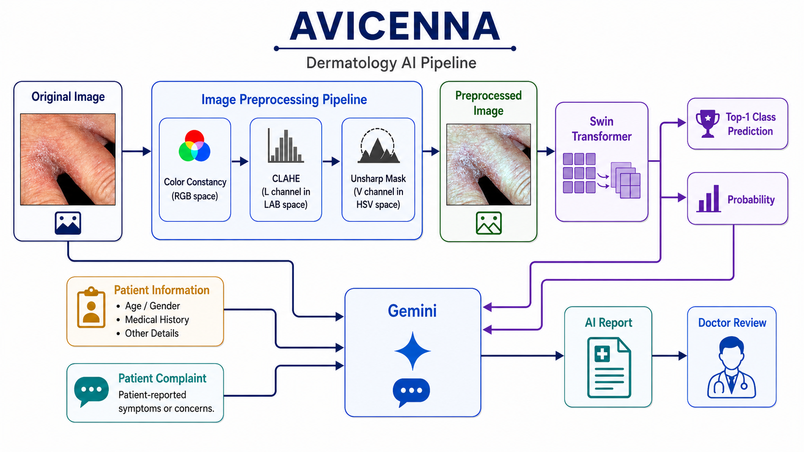
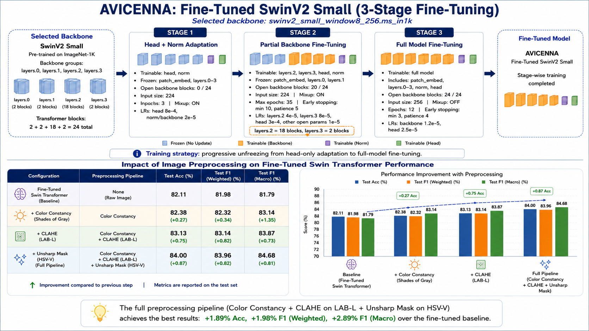

# Avicenna — AI-Powered Dermatology Assistant

> A personalized, AI-assisted dermatology platform that acts as an intelligent assistant for doctors — combining computer vision, longitudinal disease tracking, and generative AI to support clinical decision-making.  
> Built over two semesters — **METU CENG 491 (Fall) + CENG 492 (Spring), 2025–2026.**

This repository contains the **computer vision & AI report generation** components of the system:
the fine-tuned **SwinV2 Small** skin condition classifier and the **VLM-powered** (Gemini 2.5 Flash) clinical reasoning pipeline.

---

## 🔬 System Overview



Avicenna is not an autonomous diagnostic agent — it is a **doctor-in-the-loop AI assistant**.

The goal is to act as a **personalized dermatology companion**: every submission is linked to the patient's full history, so doctors can observe how a condition evolves over time — not just assess a single snapshot. This longitudinal tracking enables more controlled, data-driven monitoring at each stage of a disease.

The AI generates a structured draft report; a certified dermatologist reviews, edits, and approves it before it ever reaches the patient.

**End-to-end flow:**

1. Patient uploads a skin image + symptom info via the mobile app
2. Image passes through the **preprocessing pipeline** (Color Constancy → CLAHE → Unsharp Mask)
3. **SwinV2 Small** classifies the condition into 5 classes with confidence scores
4. A **VLM** (Gemini 2.5 Flash) receives the vision output, patient context, and historical data — and generates a structured clinical report
5. The draft is routed to the **doctor dashboard** for review and approval
6. Patient receives the finalized report only after the doctor signs off
7. Follow-up submissions are tracked chronologically — doctors monitor condition **progression over time**

---

## 🧠 ML Pipeline: Fine-Tuned SwinV2 Small



### 3-Stage Fine-Tuning Strategy

Backbone: `swinv2_small_window8_256.ms_in1k` — pre-trained on ImageNet-1K, 24 transformer blocks.  
Progressive unfreezing from head-only adaptation to full model fine-tuning:

| Stage | Trainable Layers | Input Size | Key Settings |
|---|---|---|---|
| **Stage 1** — Head & Norm | head, norm | 224 | LR: head 8e-4 / norm 2e-5 · Mixup ON · 3 epochs |
| **Stage 2** — Partial Backbone | layers.2, layers.3, head, norm | 224 → 256 | LR: 2.4e-5–3e-5 · Early stop patience 5 · max 35 epochs |
| **Stage 3** — Full Model | all layers | 256 | LR: backbone 1.2e-5 / head 2.5e-5 · Mixup OFF · 12 epochs |

### Preprocessing Pipeline — Incremental Ablation

Each step was added and evaluated independently to measure its contribution:

| Configuration | Preprocessing | Test Acc | F1 Weighted | F1 Macro |
|---|---|---|---|---|
| Fine-Tuned Baseline | None | 82.11 | 81.98 | 81.79 |
| + Color Constancy | Shades of Gray | 82.38 (+0.27) | 82.32 (+0.34) | 83.14 (+1.35) |
| + CLAHE | CC + CLAHE (LAB-L) | 83.13 (+0.75) | 83.14 (+0.82) | 83.87 (+0.73) |
| **+ Unsharp Mask — Full Pipeline** | **CC + CLAHE + Unsharp (HSV-V)** | **84.00 (+0.87)** | **83.96 (+0.82)** | **84.68 (+0.81)** |

**Net gain over baseline: +1.89 Accuracy · +1.98 F1 Weighted · +2.89 F1 Macro**

### Why This Order?

```
RGB Image
  → Color Constancy (Shades of Gray)     # normalize lighting & color balance first
  → LAB color space
  → CLAHE on L channel only              # local contrast — keeps color channels intact
  → back to RGB
  → HSV color space
  → Unsharp Mask on V channel only       # texture/edge sharpening — no hue/saturation distortion
  → back to RGB
  → SwinV2 inference
```

Color correction before contrast enhancement; sharpening last to avoid amplifying noise early.

---

## 📊 Final Model Results

| Metric | Value |
|---|---|
| Architecture | `swinv2_small_window8_256.ms_in1k` |
| Classes | acne · eczema · fungal · psoriasis · others |
| Test Accuracy (TTA-5) | **84.00%** |
| Test F1 Weighted | **0.8396** |
| Test F1 Macro | **0.8468** |
| Best Val F1 Weighted | 0.8100 (epoch 44) |
| Training Set | 6,466 images |
| Val / Test | 806 / 806 images |
| Datasets | [DermNet (Kaggle)](https://www.kaggle.com/datasets/shubhamgoel27/dermnet) + [Derm1M (HuggingFace)](https://huggingface.co/datasets/redlessone/Derm1M) |

---

## 💬 VLM Report Generation

The system is built around **Gemini 2.5 Flash** but is designed to work with any multimodal VLM capable of processing images alongside text (e.g. GPT-4o, Claude 3.5 Sonnet). Swapping the VLM only requires updating the API call in `gemini_service.py`.

The VLM receives:
- The **preprocessed skin image**
- Vision model's **top-3 predictions** with probabilities
- **Patient info:** age, gender, medical history, active allergies, skin type
- **Patient complaint:** reported symptoms

And returns a **structured JSON report** with:

| Field | Description |
|---|---|
| `gemini_analysis` | 5-paragraph clinical analysis (see structure below) |
| `gemini_summary` | ≤50-word summary of the analysis |
| `gemini_final_response` | Specific clinical subtype + confidence |
| `gemini_final_response_form` | Constrained 5-class label + confidence |

**The 5-paragraph analysis structure:**
1. **Diagnosis** — broad umbrella label + specific subtype if supported
2. **Model Evaluation** — agrees/disagrees with SwinV2 and explains why
3. **Clinical Reasoning** — visual findings + symptom correlation, differential diagnosis
4. **Treatment Approach** — conservative patient-facing recommendations
5. **Doctor Recommendation** — specific medical & herbal options for the physician only

The report is **never sent directly to the patient** — it goes to the doctor dashboard first.

---

## 🏗️ Repository Structure

```
avicenna/
├── services/
│   └── ml-service/                  # FastAPI — classification + Gemini reasoning
│       ├── app/
│       │   ├── main.py                  # REST API endpoints
│       │   └── gemini_service.py        # VLM integration & clinical prompt logic (Gemini 2.5 Flash)
│       ├── services/
│       │   ├── gemini_service.py
│       │   └── patient_health_report_service.py
│       ├── final_5_class/               # Training artifacts, confusion matrices, metrics JSON
│       │   ├── summary_...json              # Full training run metrics
│       │   ├── final_code_avixenna_5_classes.ipynb
│       │   └── cm_val_*.png             # Confusion matrix plots
│       ├── Dockerfile
│       ├── requirements.txt
│       └── .env.example
├── ml/
│   ├── notebooks/                   # All Swin training experiments
│   │   ├── final_code_avixenna_5_classes.ipynb  # ✅ Final 5-class SwinV2 training — full preprocessing pipeline
│   │   ├── dermnet_f1_oriented_model_analysis.ipynb # F1-oriented model analysis & ablation
│   │   ├── kaggle-swin-transformer-v1.ipynb         # SwinV1 baseline experiments
│   │   ├── kaggle-swin-transformer-v2.ipynb         # SwinV2 experiments
│   │   └── swin-transfomer-v3.ipynb                 # SwinV2 + preprocessing experiments
│   ├── preprocessing/segmentation/  # Skin segmentation microservice (FastAPI)
│   └── datasets/                    # Sample test images
├── rag_dataset/                     # 1,800-entry dermatology Q&A dataset (JSONL)
│   └── gemini_dataset_create.py         # Dataset generation pipeline via Gemini
├── llm/                             # LLM reasoning experiments & notebooks
│   ├── llm_gemini_reasoning.ipynb
│   └── llm_reasoning_with_swin_model.ipynb
├── swim_model/                      # Early Swin model experiments
├── docs/assets/                     # Architecture & training diagrams
├── docker-compose.yaml              # Single-command deployment
└── apps/                            # Mobile & web frontends (separate team)
```

---

## 🚀 Quick Start

### Prerequisites
- Docker & Docker Compose
- A [Google Gemini API Key](https://aistudio.google.com/app/apikey)
- Model weights file (~186 MB, not included — see below)

### 1. Clone & configure

```bash
git clone https://github.com/abdullahdrm/avicenna.git
cd avicenna

cp services/ml-service/.env.example services/ml-service/.env
# Open .env and set your GEMINI_API_KEY
```

### 2. Add model weights

Place the weights at:

```
services/ml-service/final_5_class/dermnet_5class_cc_clahe_lab_unsharp_hsvv_v2_improved_best.pth
```

> 📦 Weights are excluded from this repo (~186 MB).  
> Train from scratch using `services/ml-service/final_5_class/final_code_avixenna_5_classes.ipynb`.

### 3. Run with Docker

```bash
docker-compose up --build
```

ML service → **`http://localhost:9000`**

---

## 🔌 API Reference

### `POST /analyze`

**Request** (`multipart/form-data`):

| Field | Type | Description |
|---|---|---|
| `file` | image | Skin photo (JPG / PNG) |
| `patient_info` | string | Age, gender, symptoms, history (optional) |

**Response:**

```json
{
  "status": "success",
  "model": {
    "class_name": "eczema",
    "probability": 0.87
  },
  "gemini_analysis": "The most likely condition is eczema...",
  "gemini_summary": "Eczema with contact dermatitis pattern detected. Dermatology review advised.",
  "gemini_final_response": {
    "class": "contact dermatitis",
    "probability": 0.91
  },
  "gemini_final_response_form": {
    "class": "eczema",
    "probability": 0.91
  }
}
```

### `GET /health`

Returns service health status.

---

## 🐳 Running Without Docker

```bash
cd services/ml-service
python -m venv .venv
source .venv/bin/activate        # Windows: .venv\Scripts\activate
pip install -r requirements.txt

uvicorn app.main:app --host 0.0.0.0 --port 8000 --reload
```

---

## 🧪 Testing

```bash
# End-to-end classification + Gemini test
python services/ml-service/test_et.py

# Gemini connection test
python services/ml-service/test_gemini_class.py
```

Sample image: `services/ml-service/ornek_resim.jpg`

---

## 📓 Notebooks

| Notebook | Description |
|---|---|
| [`services/ml-service/final_5_class/final_code_avixenna_5_classes.ipynb`](services/ml-service/final_5_class/final_code_avixenna_5_classes.ipynb) | ✅ **Final** 5-class SwinV2 full pipeline (CC + CLAHE + Unsharp Mask) |
| [`ml/notebooks/dermnet_f1_oriented_model_analysis.ipynb`](ml/notebooks/dermnet_f1_oriented_model_analysis.ipynb) | F1-oriented model analysis & ablation |
| [`ml/notebooks/kaggle-swin-transformer-v1.ipynb`](ml/notebooks/kaggle-swin-transformer-v1.ipynb) | SwinV1 baseline — DermNet (Kaggle) |
| [`ml/notebooks/kaggle-swin-transformer-v2.ipynb`](ml/notebooks/kaggle-swin-transformer-v2.ipynb) | SwinV2 experiments — DermNet (Kaggle) |
| [`ml/notebooks/swin-transfomer-v3.ipynb`](ml/notebooks/swin-transfomer-v3.ipynb) | SwinV2 + preprocessing — Kaggle + Derm1M |
| [`llm/llm_gemini_reasoning.ipynb`](llm/llm_gemini_reasoning.ipynb) | Gemini reasoning integration experiments |
| [`llm/llm_reasoning_with_swin_model.ipynb`](llm/llm_reasoning_with_swin_model.ipynb) | Combined vision + LLM pipeline experiments |
| [`rag_dataset/gemini_dataset_create.py`](rag_dataset/gemini_dataset_create.py) | Dermatology RAG dataset generation (1,800 Q&A) |

---

## ⚙️ Environment Variables

| Variable | Description |
|---|---|
| `GEMINI_API_KEY` | Google Gemini API key — [get one here](https://aistudio.google.com/app/apikey) |

Copy `services/ml-service/.env.example` → `services/ml-service/.env`.

---

## 🛠️ Tech Stack

| Layer | Technology |
|---|---|
| ML Model | SwinV2 Small (`timm`) + PyTorch · 3-stage progressive fine-tuning |
| Preprocessing | Color Constancy (Shades of Gray) · CLAHE (LAB-L) · Unsharp Mask (HSV-V) · OpenCV · PIL |
| LLM | Google Gemini 2.5 Flash · structured JSON output · 5-paragraph clinical prompt |
| API | FastAPI + Uvicorn |
| Containerization | Docker · Docker Compose |
| Datasets | [DermNet (Kaggle)](https://www.kaggle.com/datasets/shubhamgoel27/dermnet) + [Derm1M (HuggingFace)](https://huggingface.co/datasets/redlessone/Derm1M) · 5-class · 6,466 train / 806 val / 806 test |

---

## 📄 License

Developed for academic purposes — METU CENG 492, Spring 2025–2026.
